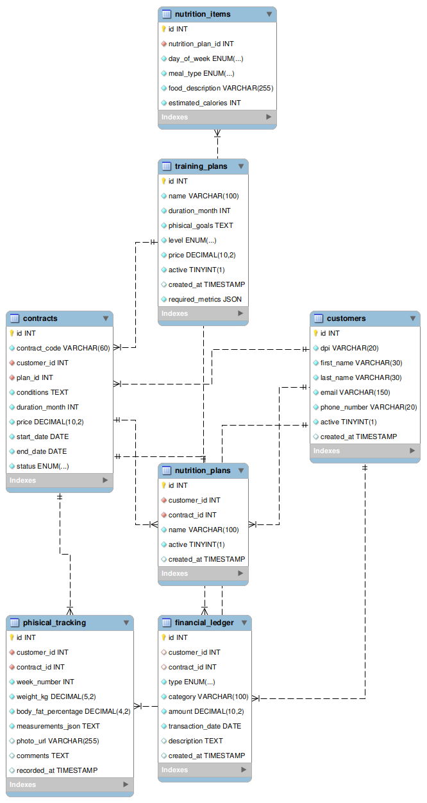

# Gym Core System — Cardinalidad de la Base de Datos

La base de datos `gym_core_system_db` está diseñada para representar la relación entre clientes, contratos, planes de entrenamiento, seguimiento físico, nutrición y movimientos financieros.

## Cardinalidad entre tablas



### Customers → Contracts

**1 : N**

Un cliente puede tener **uno o varios contratos**, mientras que cada contrato pertenece obligatoriamente a **un solo cliente**.

```text
customers (1) ──────── (N) contracts
```

### Training Plans → Contracts

**1 : N**

Un plan de entrenamiento puede estar asociado a **muchos contratos**, pero cada contrato utiliza **un solo plan**.

```text
training_plans (1) ──────── (N) contracts
```

### Customers → Physical Tracking

**1 : N**

Un cliente puede tener **múltiples registros de seguimiento físico**. Cada registro pertenece a un único cliente.

```text
customers (1) ──────── (N) phisical_tracking
```

Además, un contrato puede tener múltiples registros de seguimiento, pero **solo uno por semana**, debido a:

```sql
UNIQUE (contract_id, week_number)
```

### Customers → Nutrition Plans

**1 : N**

Un cliente puede tener **varios planes nutricionales**, y cada plan nutricional pertenece a un único cliente.

```text
customers (1) ──────── (N) nutrition_plans
```

### Contracts → Nutrition Plans

**1 : N**

Un contrato puede estar relacionado con **varios planes nutricionales**, mientras que cada plan nutricional pertenece a un único contrato.

```text
contracts (1) ──────── (N) nutrition_plans
```

### Nutrition Plans → Nutrition Items

**1 : N**

Un plan nutricional puede contener **múltiples alimentos o comidas**, pero cada elemento pertenece a un único plan.

```text
nutrition_plans (1) ──────── (N) nutrition_items
```

### Customers → Financial Ledger

**1 : N**

Un cliente puede tener **múltiples movimientos financieros**. La relación es opcional porque `customer_id` permite valores `NULL`.

```text
customers (1) ──────── (N) financial_ledger
```

### Contracts → Financial Ledger

**1 : N**

Un contrato puede estar asociado con **múltiples movimientos financieros**. Esta relación también es opcional porque `contract_id` permite `NULL`.

```text
contracts (1) ──────── (N) financial_ledger
```

## Resumen

| Relación                          | Cardinalidad |
| --------------------------------- | ------------ |
| Customers → Contracts             | 1 : N        |
| Training Plans → Contracts        | 1 : N        |
| Customers → Physical Tracking     | 1 : N        |
| Contracts → Physical Tracking     | 1 : N        |
| Customers → Nutrition Plans       | 1 : N        |
| Contracts → Nutrition Plans       | 1 : N        |
| Nutrition Plans → Nutrition Items | 1 : N        |
| Customers → Financial Ledger      | 1 : N        |
| Contracts → Financial Ledger      | 1 : N        |

### Diseño

El modelo utiliza principalmente relaciones **uno a muchos (1:N)**. Esto permite que un cliente mantenga un historial de contratos, progreso físico, planes nutricionales y movimientos financieros, manteniendo la integridad referencial mediante claves foráneas.
