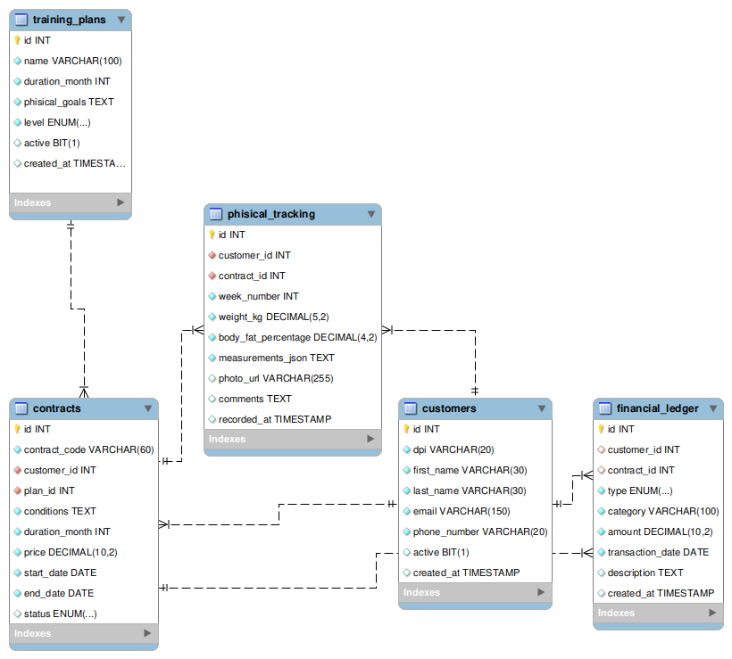

# Modelo Relacional y Cardinalidad: Gym Core System DB

Este documento detalla la arquitectura de la base de datos relacional para el **Gym Core System CLI**. El motor de almacenamiento de alta integridad **`InnoDB`**, el cual proporciona soporte para llaves foráneas (`FOREIGN KEY`) y bloqueos a nivel de fila.

---

## 1. Diagrama de Entidad-Relación

A continuación se muestra cómo se conectan las tablas físicamente.

---

## 2. Explicación Detallada de la Cardinalidad

El sistema se compone de 5 entidades.

### A. Clientes (`customers`) ─── Uno a Muchos (1:N) ─── Contratos (`contracts`)
*   **Lógica de Negocio:** Un cliente se inscribe en el gimnasio y puede acumular **múltiples contratos a lo largo del tiempo** (un contrato completado el año pasado, uno cancelado y uno activo en el ciclo actual). Sin embargo, un registro de contrato específico pertenece de forma obligatoria y única a **un solo cliente**.
*   **Llave Foránea:** `contracts.customer_id` mapea directamente a `customers.id`.

### B. Planes (`training_plans`) ─── Uno a Muchos (1:N) ─── Contratos (`contracts`)
*   **Lógica de Negocio:** Un plan de entrenamiento diseñado por el gimnasio (por ejemplo, "Plan Hipertrofia Avanzado") puede ser vendido y estar asociado a **muchos contratos** de distintos clientes. Por el contrario, un contrato particular ampara y describe únicamente **un solo plan** de entrenamiento comercial al mismo tiempo.
*

### C. Contratos (`contracts`) ─── Uno a Muchos (1:N) ─── Seguimiento Físico (`phisical_tracking`)
*   **Lógica de Negocio:** Un contrato vigente acumula **un registro de avance por cada semana transcurrida** (Semana 1, Semana 2, Semana 3...). Cada registro de progreso métrico se genera bajo el contexto contractual del plan que el cliente está ejecutando en ese momento exacto.
*

### D. Contratos (`contracts`) ─── Uno a Muchos (1:N) ─── Planes Nutricionales (`nutritional_plans`)
*   **Lógica de Negocio:** Para cumplir con el requerimiento de reportes nutricionales semanales, un contrato vincula hasta **7 registros alimenticios distintos**, mapeados individualmente a los días de la semana. Esto permite variar la ingesta calórica diaria según el desgaste programado.
* 

### E. Contratos (`contracts`) ─── Cero/Uno a Muchos (0/1:N) ─── Libro Contable (`financial_ledger`)
*   **Lógica de Negocio Crítica:** Esta relación cuenta con una flexibilidad clave a nivel de negocio. 
    *   **Si el movimiento es un INGRESO** (pago de mensualidad o inscripción), el registro en el ledger **debe apuntar obligatoriamente** al `customer_id` y al `contract_id` correspondientes para auditar el dinero de esa membresía.
    *   **Si el movimiento es un EGRESO** (gastos operativos del gym), los campos `customer_id` y `contract_id` quedan como `DEFAULT NULL`. Esto permite que el balance general calcule ingresos y egresos globales del gimnasio sin romper restricciones de llaves foráneas.

---
